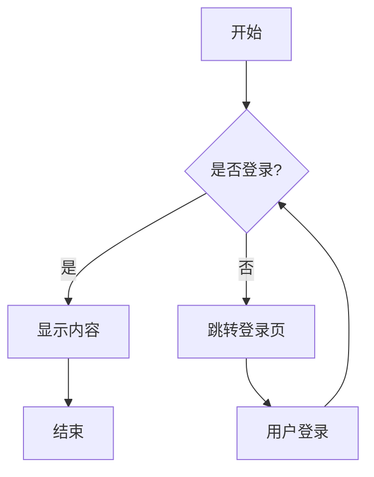
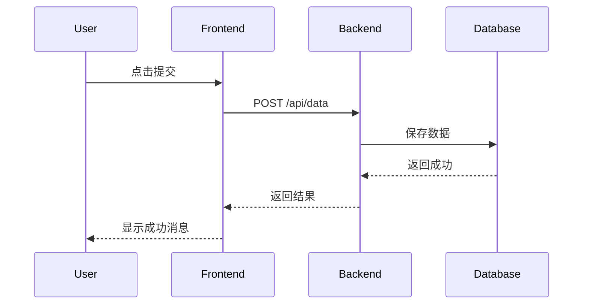
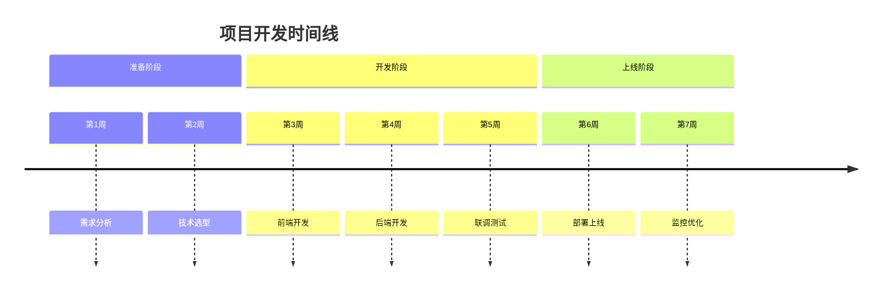

# Markdown语法演示

这篇文章展示了所有支持的Markdown语法。

## 代码高亮

### JavaScript

```javascript
function greet(name) {
  console.log(`Hello, ${name}!`)
  return {
    message: `Welcome to our site`,
    timestamp: Date.now()
  }
}

// 调用函数
const result = greet('Fufu')
console.log(result.message)
```

### Python

```python
def calculate_area(radius):
    """计算圆的面积"""
    import math
    return math.pi * radius ** 2

# 使用示例
areas = [calculate_area(r) for r in [1, 2, 3, 4, 5]]
print(f"Areas: {areas}")
```

### TypeScript

```typescript
interface User {
  id: number
  name: string
  email: string
}

function validateUser(user: User): boolean {
  return user.name.length > 0 && user.email.includes('@')
}
```

## 数学公式

### 行内公式

质能方程 $E = mc^2$ 是物理学中最著名的公式。

圆的面积公式是 $A = \pi r^2$。

### 块级公式

泰勒展开式：

$$
f(x) = f(a) + f'(a)(x-a) + \frac{f''(a)}{2!}(x-a)^2 + \frac{f'''(a)}{3!}(x-a)^3 + \cdots
$$

傅里叶变换：

$$
\hat{f}(\xi) = \int_{-\infty}^{\infty} f(x) e^{-2\pi i x \xi} dx
$$

## Mermaid图表

### 流程图



### 时序图



### 时间线



## GFM表格

| 功能 | 状态 | 优先级 |
|------|:----:|-------:|
| 代码高亮 | ✅ | 高 |
| 数学公式 | ✅ | 高 |
| Mermaid图表 | ✅ | 中 |
| GFM表格 | ✅ | 低 |

## 任务列表

- [x] 代码高亮实现
- [x] 数学公式支持
- [x] Mermaid图表渲染
- [x] GFM表格样式
- [ ] 评论系统集成
- [ ] 搜索功能实现

## 引用块

> 这是一段引用文字。
>
> 可以包含多行内容。

## 列表

### 无序列表

- 第一项
- 第二项
  - 子项A
  - 子项B
- 第三项

### 有序列表

1. 步骤一
2. 步骤二
3. 步骤三

## 链接和图片

[访问GitHub](https://github.com)

### 图片尺寸控制

支持自定义尺寸语法：``

原始大小：


固定宽度 300px：


固定宽高 200x150：


### 语法说明

- `` - 只设置宽度 200px
- `` - 设置宽度 200px，高度 100px
- `` - 只设置高度 100px

---

以上就是所有支持的Markdown语法！